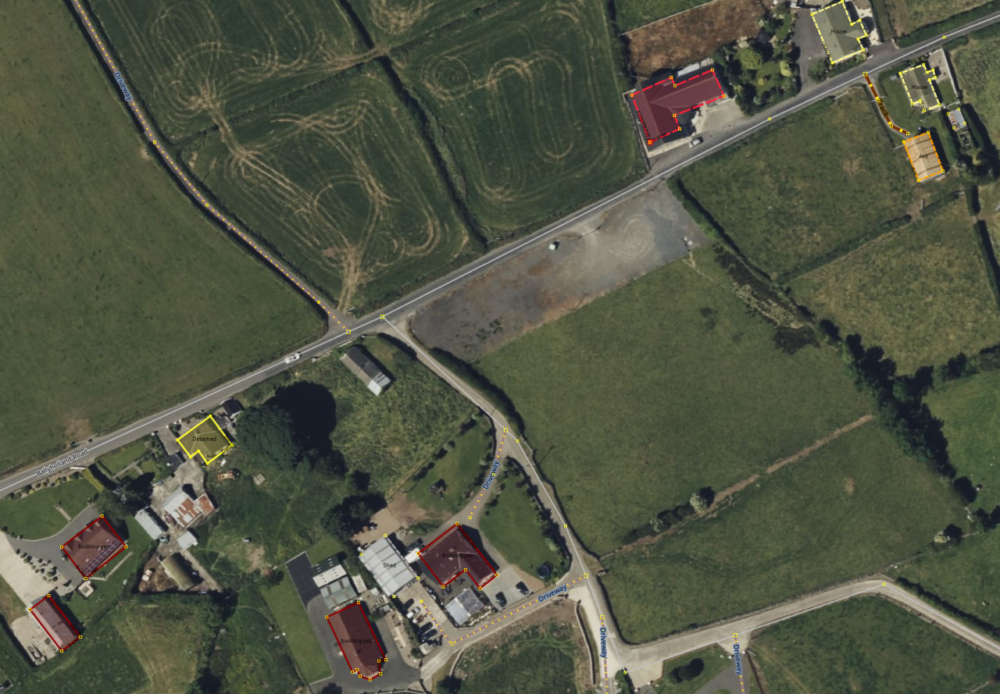

# josm-customizations
Some configs for my preferred JOSM setup.

## Map Paint Styles
This is useful for coloring the building types so you can see at a glance whether a building has been tagged as building:yes or more precisely as a shed, garage or house.
My stylesheet is a slight modification of the existing 'Colored Buildings.en' by riiga with a few more buildings common in Ireland.
### Usage
- In JSOM visit Edit > Preferences
- Choose the 'Map Paint Styles' menu
- Choose the '+' button to add a new style
- For the url use: https://raw.githubusercontent.com/jonnymccullagh/josm-customizations/main/styles/coloured_buildings_1.4.en.css
- Give the style a name and click OK
- Click 'Okay' to exit the Preferences dialog
- You hopefully have coloured buildings

## Presets
An XML backup of the custom presets I like to add to the JOSM toolbar for quick access.
### Usage
This can be added to JOSM using:
- In JSOM visit Edit > Preferences
- Choose the 'Tagging Presets' menu
- Choose the '+' button to add a new preset
- For the url use: https://raw.githubusercontent.com/jonnymccullagh/josm-customizations/main/presets/josm_presets_20230413.xml
- Give the preset a name and click OK
- Click 'Okay' to exit the Preferences dialog

