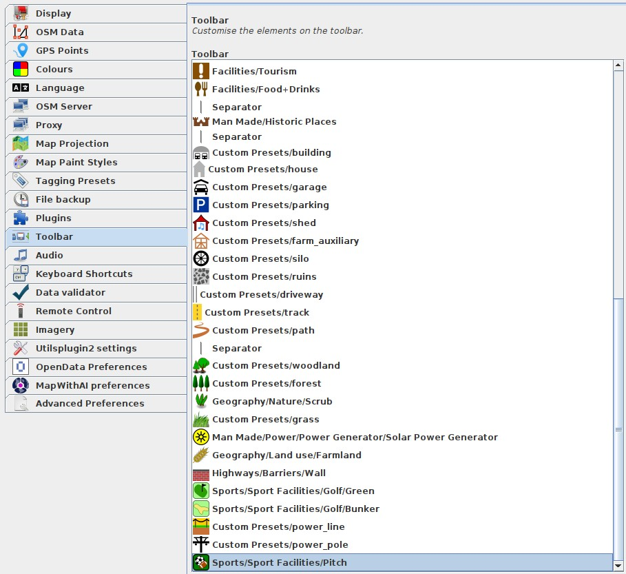
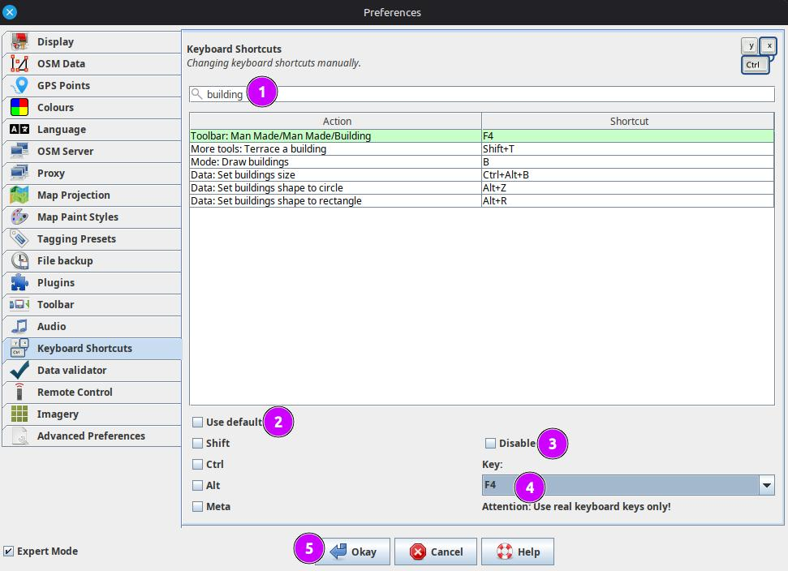
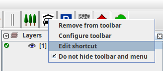
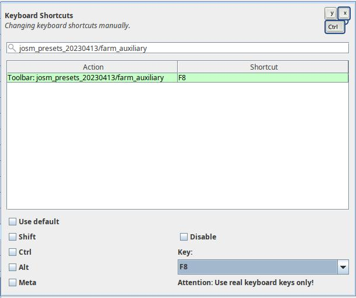
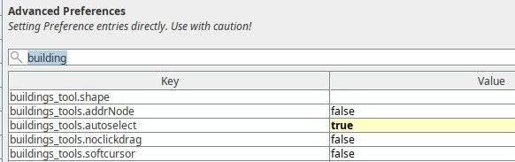

# josm-customizations
Some configs for my preferred JOSM setup.

## Map Paint Styles
This is useful for coloring the building types so you can see at a glance whether a building has been tagged as building:yes or more precisely as a shed, garage or house.
My stylesheet is a slight modification of the existing 'Colored Buildings.en' by riiga with a few more buildings common in Ireland.
### Usage
- In JSOM visit Edit > Preferences
- Choose the 'Map Paint Styles' menu
- Choose the '+' button to add a new style
- For the url use: https://raw.githubusercontent.com/jonnymccullagh/josm-customizations/main/styles/coloured_buildings_1.4.en.css
- Give the style a name and click OK
- Click 'Okay' to exit the Preferences dialog
- You hopefully have coloured buildings


## Presets
An XML backup of the custom presets I like to add to the JOSM toolbar for quick access.
### Usage
This can be added to JOSM using:
- In JSOM visit Edit > Preferences
- Choose the 'Tagging Presets' menu
- Choose the '+' button to add a new preset
- For the url use: https://raw.githubusercontent.com/jonnymccullagh/josm-customizations/main/presets/josm_presets_20230413.xml
- Give the preset a name and click OK
- Click 'Okay' to exit the Preferences dialog


## Toolbar Icons
I couldn't find a way to export the shortcuts I have on my toolbar so screenshotting here for future reference. In JSOM visit `Edit > Preferences > Toolbar`.



## Keyboard Shortcuts
I like to use function keys as shortcuts to label buildings. It seems difficult to manage this in the `Edit > Preferences > Keyboards` 


My alternative is to right-click the toolbar icon and choose 'Edit Shortcut'


- untick `use default`
- untick `Disable`
- Choose the shortcut key e.g. F5
- choose **Okay**



## Autokey

On Linux I am using Autokey to provide keyboard shortcuts for terracing buildings. An example script for this is below:
```python
import time
keyboard.send_keys("<shift>+t")
time.sleep(0.3)
keyboard.send_keys("<tab>")
keyboard.send_keys("<tab>")
keyboard.send_keys("<tab>")
keyboard.send_keys("<backspace>")
keyboard.send_keys("4")
time.sleep(0.1)
keyboard.send_keys("<enter>")
time.sleep(0.1)
keyboard.send_keys("<f5>")
```
I set this to only apply to the JOSM window (identified as `org-openstreetmap-josm-gui-MainApplication.org-openstreetmap-josm-gui-MainApplication`) and set it to the shortcut key Ctrl+4.
I create these for all the number keys on the keypad. In the example above the F5 is to set the building type to house.

## Plugins
I like to use the building_tools and terracer plugins.
Once installed I set the `buildings_tools.autoselect` preference to `true` as shown below:


